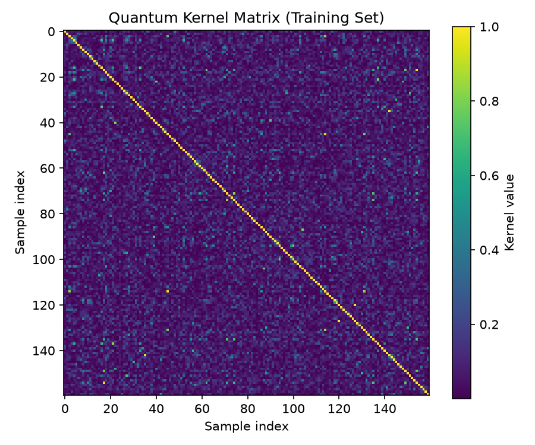

# QuFraud — Quantum Kernel SVM for Credit Card Fraud Detection

**Status:** MVP / proof-of-concept — undergraduate research project, QPeru

A quantum machine learning experiment applying quantum kernel methods (Schuld & Killoran, 2019) to credit card fraud detection, benchmarked against a classical SVM baseline. Built as part of ongoing QML coursework and lightning talk material for the Leiden↔Chile Research Seminar (LCRS) 2026.

---

## Overview

This project asks a narrow, honest question: **does mapping transaction data into a quantum feature space help a classifier separate fraud from legitimate transactions, compared to a classical kernel?**

The short answer, on this run: yes, modestly — but on a small test set, and without cross-validation yet. See [Results](#results) and [Limitations](#limitations) below before drawing conclusions from this alone.

---

## Dataset

- **Source:** [Kaggle — Credit Card Fraud Detection (mlg-ulb)](https://www.kaggle.com/datasets/mlg-ulb/creditcardfraud)
- 284,807 transactions, 492 labeled fraud, PCA-anonymized features `V1`–`V28`, plus `Time` and `Amount`
- **Subset used:** balanced sample of 100 fraud + 100 legitimate transactions (`random_state=42` for reproducibility)
- **Features:** top 4 components by variance among `V1`–`V28` (already PCA-derived by the dataset itself — no additional PCA applied)
- **Split:** 80/20 stratified → 160 train (80/80), 40 test (20/20)
- **Scaling:** `MinMaxScaler` fit on train only, scaled to the embedding's required range; test set transformed with the same scaler (may slightly exceed range at the extremes — standard behavior, noted in case it affects the encoding circuit)

---

## Pipeline

```
Credit Card Fraud Dataset (Kaggle)
        ↓
Balanced Subset (100 fraud + 100 legit), top-4 PCA features
        ↓
Feature Scaling to embedding-compatible range
        ↓
Quantum Feature Map (fixed, untrained — see note below)
        ↓  kernel matrix k(x,x') = |⟨φ(x)|φ(x')⟩|²
Classical SVM — SVC(kernel='precomputed')
        ↓
Prediction on Test Set (n=40)
        ↓
Fraud / Not Fraud
```

> **Note:** the quantum kernel here is a *fixed* feature map (no trainable circuit parameters) — this is a quantum kernel method, not a variational quantum classifier. No VQA-based kernel optimization is performed in this version.

Implemented in PennyLane. Classical baseline uses scikit-learn's `SVC(kernel='rbf')` on the identical split for direct comparison.

---

## Kernel Concentration — a diagnosis, not a footnote

The first working kernel (`IQPEmbedding`, 2 repeats, scaled to full rotation range) showed strong **exponential concentration**: near-identity matrix, diagonal ≈ 1.0, almost all off-diagonal values near zero.



This is a known failure mode for expressive quantum kernels — related to the barren plateau phenomenon, but affecting kernel values instead of gradients (see Thanasilp et al., Kübler et al.).

**Diagnostics tested** (off-diagonal mean ± std, higher = healthier):

| Variant | Config | Off-diag mean ± std |
|---|---|---|
| Baseline | IQP, reps=2, full range | 0.081 ± 0.087 |
| Var 1 | IQP, reps=1, full range | 0.099 ± 0.106 |
| Var 2 | IQP, reps=2, narrowed range | 0.205 ± 0.234 |
| Var 3 | AngleEmbedding (no entanglement), full range | 0.411 ± 0.342 |

**Findings:**
- Reducing repetitions alone (Var 1) barely moved the needle — circuit depth was not the dominant cause.
- Narrowing the encoding range (Var 2) helped substantially *even with entanglement still present*.
- Removing entanglement entirely (Var 3, plain `AngleEmbedding`) gave the strongest improvement of the three.
- Since Var 2 and Var 3 each change a different single factor and both help, the concentration here isn't attributable to one isolated cause — both the entangling structure and the encoding range contribute, with the entangling embedding appearing to be the larger single lever of the two tested.

The `AngleEmbedding` configuration (Var 3) was used for the classifier below.

---

## Results

### QSVM (quantum kernel, AngleEmbedding)

| Metric | Value |
|---|---|
| Accuracy | 0.875 |
| F1 | 0.872 |
| Recall (fraud) | 0.850 |

|  | pred legit | pred fraud |
|---|---|---|
| **true legit** | 18 | 2 |
| **true fraud** | 3 | 17 |

### Classical SVM (RBF), same split

| Metric | Value |
|---|---|
| Accuracy | 0.825 |
| F1 | 0.811 |
| Recall (fraud) | 0.750 |

|  | pred legit | pred fraud |
|---|---|---|
| **true legit** | 18 | 2 |
| **true fraud** | 5 | 15 |

### Side-by-side

| Metric | Classical RBF | Quantum QSVM |
|---|---|---|
| Accuracy | 82.5% | 87.5% |
| F1 | 0.811 | 0.872 |
| Recall (fraud) | 75.0% | 85.0% |

*n = 40 test samples — single split, not cross-validated.*

For reference, a 2D visualization of the classical SVM decision boundary (2 of the 4 PCA components, for visualization only — the actual model uses all 4):


---

## Limitations

- **Test set is small (n=40).** Each misclassified case swings accuracy by 2.5 points and recall by 5 points — a single flipped prediction changes the headline numbers noticeably. This comparison should not be read as a reliable claim of quantum advantage.
- **Single train/test split.** No k-fold cross-validation has been run yet, so it's not yet known whether the quantum kernel's edge holds up or is noise from this particular split.
- **Simulated, not hardware-run.** All kernel computations use classical simulation of the quantum circuits — no real quantum hardware or hardware noise is reflected here.
- **Dataset is not LatAm-specific.** No public LatAm/Chile/Peru fraud dataset currently exists for this kind of benchmark; this uses the standard European cardholder dataset for comparability with prior QML literature.

---

## Next Steps

- [ ] 5-fold (or 10-fold) cross-validation, comparing classical RBF vs. quantum kernel SVM, reporting mean ± std across folds
- [ ] Test the untried combination: reps=1 + narrowed range together (may combine the benefits of Var 1 and Var 2 without fully dropping entanglement)
- [ ] Extend from classification (QSVM) toward the author's thesis direction: combinatorial optimization via QAOA/QUBO (GPS/MPF vs. QUBO formulations for TSP)

---

## What This MVP Is Not (Yet) — Toward a More Complex Run

This is a deliberately small proof of concept: 4 qubits, 160 training samples, one train/test split, run entirely on a classical simulator. To call this a genuinely complex QML experiment rather than a demo, several things would need to change:

### More qubits, real feature richness
- Currently only 4 of the 28 available `V` features are used, one per qubit. Scaling to 8, 12, or 16 qubits (still simulable classically, though increasingly slow — state vectors grow as 2ⁿ) would let the model use more of the dataset's actual information instead of throwing most of it away at the PCA step.
- Beyond ~20–25 qubits, classical simulation becomes impractical on a laptop; that's the point where this would need either a smaller/sparser encoding strategy or real quantum hardware access (IBM Quantum, IonQ, Amazon Braket).

### Using superposition explicitly, not just angle rotations
- The current `AngleEmbedding` puts each qubit into a superposition individually (`RY`/`RX` rotations from `|0⟩`), but qubits don't interact — there's no *joint* superposition across the register beyond what single-qubit rotations give you. It's the simplest possible use of superposition, chosen specifically to avoid the entanglement-driven concentration problem documented above.
- A "more complex" run in the sense of genuinely leveraging multi-qubit superposition would reintroduce entangling gates (Hadamards + CNOTs, or the `IQPEmbedding`/`ZZFeatureMap` tested earlier) — but that's exactly what caused kernel concentration here. This is the real tension to design around: entanglement is what makes a quantum kernel potentially more expressive than a classical one, but it's also what collapsed this kernel toward the identity matrix. Threading that needle — enough entanglement for expressivity, not so much that kernel values concentrate — is an open design problem, not a solved one, in this project.
- Concretely testable next step: sweep a *partial* entangling pattern (e.g., entangle only nearest-neighbor qubit pairs instead of all-to-all) and re-run the same concentration diagnostics used above, to see if there's a middle ground between plain `AngleEmbedding` (Var 3) and full `IQPEmbedding` (baseline).

### Larger and less artificially balanced data
- The 100/100 balanced subset is convenient but not realistic — real fraud is ~0.17% of transactions. A more complex run would use the full class imbalance (with appropriate handling: class weighting, SMOTE, or a precision/recall-focused metric rather than accuracy) instead of sidestepping the imbalance by undersampling.

### Repeated evaluation, not a single split
- As already flagged: k-fold cross-validation (or repeated random splits with different seeds) to know whether the quantum kernel's edge is real or an artifact of this particular 40-sample test set.

### Real hardware, real noise
- Everything above assumes a noiseless simulator. Running the same circuit on real quantum hardware introduces decoherence and gate errors that could change — or erase — any advantage seen here. Reporting simulator-only results as if they reflect real hardware behavior would overstate what's been shown.

None of this needs to happen before the lightning talk or this MVP write-up — but it's the honest answer to "what's missing to make this a complex run," and doubles as the roadmap for turning this into an actual paper.

---

## References

- Biamonte, J., Wittek, P., Pancotti, N., Rebentrost, P., Wiebe, N., & Lloyd, S. (2017). Quantum Machine Learning. *Nature*, 549, 195–202.
- Schuld, M., & Killoran, N. (2019). Quantum Machine Learning in Feature Hilbert Spaces. *Physical Review Letters*, 122(4), 040504.
- Thanasilp, S., et al. Exponential concentration in quantum kernel methods.
- Kübler, J. M., et al. The inductive bias of quantum kernels.
- [YouTube video](https://www.youtube.com/watch?v=XB8mg8cdEJM&t=226s) — used as supporting explanation while building intuition for this project.
- [YouTube video](https://www.youtube.com/watch?v=aqXuYXFIjQk) — used as supporting explanation while building intuition for this project.

---

*Part of QPeru's ongoing quantum machine learning research track. Author: Maju.*
